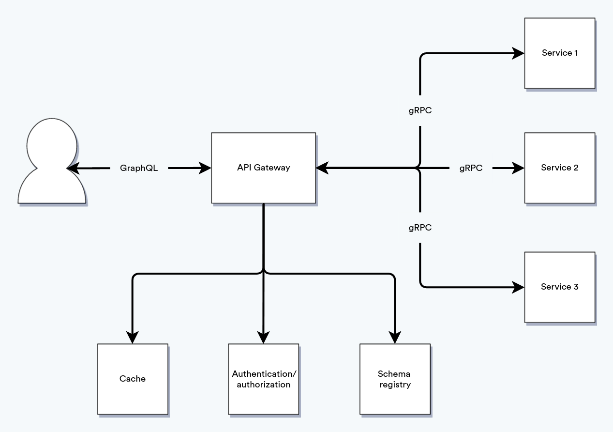

  
API Gateway является одним из обязательных компонентов архитектуры современных систем. Он может решать различные задачи:
* Проксирование вызовов из одной точки в разные сервисы в разных форматах. Контроль доступа к ним.
* Мониторинг.
* Аутентификация и авторизация.
* Агрегация данных (один запрос к API Gateway - несколько запросов к бэку).
* Управление таймаутами.
* Кэширование данных.
* Валидация.
* И многое другое.

При отсутствии API Gateway все эти задачи ложатся на бэкенд. И если для монолита это может быть оправдано, то в микросервисах любое изменение общей логики повлечёт доработку всех зависимых сервисов.  
Есть много интересных готовых решений, в т.ч. и для нашего кейса (GraphQL <-> gRPC), но ни одно из них не подошло нам в полной мере.

# Почему GraphQL
На нашем проекте API Gateway нужен в основном для запросов с фронта. Когда мы только начинали, основным видом взаимодействия был REST. 
Он достаточно прост для понимания и реализации, но в процессе развития проекта начали проявляться его недостатки:
* При обновлении сущности, даже если обновить нужно пару полей, мы обновляли весь объект. 
Да, можно использовать метод PATCH и парсить на бэке только переданные поля, рассматривая отдельно переданное поле со значением null и случай, 
когда поле не передано, но это не стандартный подход для REST.
* Не всегда при запросе на получение сущности нужны все поля. Можно сделать несколько методов вместо одного, 
но тогда для каждого кейса придётся делать отдельный метод. 
А если для одной и той же структуры у пользователей с разными ролями будут разные доступы к полям, которые, к тому же, могут меняться, реализовать это, используя REST, невозможно.
* Нет пакетной обработки. Для получения данных из каждого сервиса фронт делает отдельные запросы.

GraphQL, [хоть и имеет свои недостатки](https://habr.com/ru/post/425041/), успешно решает эти проблемы. 
В качестве бонуса в GraphQL в отличие от REST есть [директивы](https://graphql.org/learn/queries/#directives). 
Их использование даёт возможность делать свои обработчики для полей запроса, императивно добавлять кэширование, валидацию и прочее.

# Почему gRPC
С API для фронта разобрались, переходим на бэк. Проблемы остаются те же, за исключением пакетной обработки (на бэке таких кейсов нет и не предвидится). 
Можно изначально делать API бэка на GraphQL, это бы значительно упростило создание API Gateway. Но на бэке с ним тоже не всё просто.  
Мы пишем на Java, используем [Quarkus](https://quarkus.io), и для работы с GraphQL там есть неплохие на первый взгляд решения как для [серверной части](https://quarkus.io/guides/smallrye-graphql), 
так и для [написания клиентов](https://quarkus.io/guides/smallrye-graphql-client). 
С серверной частью проблем нет, а вот клиенты не очень подходят для постоянного использования.  
[Typesafe-клиент](https://quarkus.io/guides/smallrye-graphql-client#using-the-typesafe-client) очень прост и минималистичен.
```java
//определение клиента
@GraphQLClientApi(configKey = "star-wars-typesafe")
public interface StarWarsClientApi {

    FilmConnection allFilms();

}

//пример запроса
public class StarWarsResource {
    @Inject
    StarWarsClientApi typesafeClient;

    public FilmConnection getAllFilms() {
        return typesafeClient.allFilms();
    }
}
```
Однако такой клиент не даёт возможности делать частичное обновление или выбирать поля для формирования ответа.  
[Dynamic-клиент](https://quarkus.io/guides/smallrye-graphql-client#using-the-dynamic-client) очень гибкий. 
Можно передавать какой угодно набор полей, можно использовать [переменные](https://graphql.org/learn/queries/#variables), можно задавать список полей, которые мы хотим получить в ответе.
```java
public class StarWarsResource {

    @Inject
    @GraphQLClient("star-wars-dynamic")
    DynamicGraphQLClient dynamicClient;
    
    public FilmConnection getAllFilmsUsingDynamicClient() {
        Document query = document(
                operation(
                        field("allFilms",
                                field("films",
                                        field("title"),
                                        field("planetConnection",
                                                field("planets",
                                                        field("name")
                                                )
                                        )
                                )
                        )
                )
        );
        Response response = dynamicClient.executeSync(query);
        return response.getObject(FilmConnection.class, "allFilms");
    }

}
```
Но это очень громоздко. К тому же при формировании запроса можно допустить ошибку.  
В gRPC есть возможность генерировать типобезопасные контроллеры и клиенты. А для ограничения списка полей, которые возвращаются в ответ, есть специальный тип - [FieldMask](https://developers.google.com/protocol-buffers/docs/reference/csharp/class/google/protobuf/well-known-types/field-mask).  
В gRPC в качестве формата запросов-ответов используется protobuf. Его же мы используем для сообщений в асинхронном взаимодействии через kafka. 
Т.о. нам не нужно плодить форматы, и мы можем использовать на бэке что-то одно.  
Часто, когда говорят о преимуществах gRPC, упоминают возможность потоковой передачи данных, снижающей накладные расходы. 
Мы к этому пока не пришли, но хотелось бы иметь такую возможность в будущем.  
В protobuf есть [проблема с передачей null-значений](https://habr.com/ru/company/otus/blog/546182/), но её мы решили по-своему (об этом будет написано далее)

# Готовые решения
Ранее я писал, что на бэке мы используем Java в качестве основного языка программирования, поэтому хотелось бы найти именно готовое решение на нём. 
Единственное, что удалось найти, это проект [Rejoiner](https://rejoiner.io/). Выглядит интересно, но это не коробочное решение, а именно библиотека. 
К тому же для каждого эндпоинта при его использовании придётся писать свой обработчик, что не очень удобно, т.к. при его добавлении/изменении придётся пересобирать проект. 
Ещё один минус - проект последнее время не развивается. Однако именно в его исходниках удалось почерпнуть много полезной информации для создания собственного API Gateway.  
Ещё один интересный проект - [GraphQL Mesh](https://www.graphql-mesh.com/) - написан на TypeScript и предоставляет возможность маппинга из GraphQL не только в gRPC, но и используя другие способы взаимодействия. 
Но он не даёт возможности кастомизировать маппинг типов и добавлять свои обработчики для запросов. Всё это можно было бы сделать самим, но пишем мы на Java.  
Есть решения на Go, но они предполагают генерацию API Gateway из контракта, что нас не устраивает. В итоге было принято решение написать свой API Gateway на нашем стэке технологий.

# Реализация
Список основных требований к концепту:
* Сервис должен быть написан на Java/Quarkus.
* В сервисе не должно быть кодогенерации DTO и стабов, которые необходимо использовать для вызова сервисов.
* В сервисе должна быть возможность "горячего обновления" контракта. При изменении сервисов на бэке не должно быть необходимости править код API Gateway.
* Поддержка batch-запросов.

## Необходимые зависимости
```groovy
ext {
        quarkusVersion = "2.7.4.Final"
        graphqlVersion = "17.0"
        lombokVersion = "1.18.22"
}

dependencies {
    implementation(
            platform("io.quarkus:quarkus-bom:$quarkusVersion"),
            "io.quarkus:quarkus-config-yaml",
            "io.quarkus:quarkus-grpc-common",
            "io.quarkus:quarkus-grpc-stubs",
            "com.graphql-java:graphql-java-extended-scalars:$graphqlVersion",
            "com.graphql-java:graphql-java-extended-validation:$graphqlVersion",
            "io.vertx:vertx-web-graphql",
            "com.google.protobuf:protobuf-java-util",
            "com.fasterxml.jackson.core:jackson-databind",
    )
    compileOnly("org.projectlombok:lombok:$lombokVersion")
    annotationProcessor("org.projectlombok:lombok:$lombokVersion")
}
```
`quarkus-...` - зависимости фреймворка для работы с YAML-конфигом и gRPC.  
`graphql-java-extended-scalars` - добавляет скаляры GraphQL. Из коробки поддерживается не так много типов, поэтому без использования этой зависимости не обойтись.  
`graphql-java-extended-validation` - добавляет директивы для валидации запросов.  
`protobuf-java-util` - нужно для логирования запросов-ответов от gRPC-сервера в формате JSON.  
`jackson-databind` - нужно для корректного логирования в формате JSON  
`vertx-web-graphql` - нужно для конфигурации серверной части GraphQL с помощью... Vertx.  
Хотя Quarkus и является основным фреймворком для приложения, но он, к сожалению, больше заточен на подход code-first, 
а мы строго придерживаемся подхода contract-first. К тому же при подходе code-first нам бы не удалось реализовать какой-то универсальный обработчик. 
Поэтому фактически от Quarkus в проекте будет только DI, конфигурация и запросы к gRPC-сервисам. А для создания и настройки основного обработчика больше подходит Vertx.  
`Примечание: у Quarkus под капотом находится Vertx, что бывает очень полезно для написания каких-то низкоуровневых вещей. 
Серверная часть Quarkus полностью основана на Vertx, реактивные REST/GraphQL клиенты под капотом используют HTTP-клиент из Vertx, работа с БД идёт через библиотеки Vertx. 
Однако не все компоненты, для которых есть реализация в Vertx, переиспользуются в Quarkus. 
Серверная часть для GraphQL и обёртка для работы с gRPC в Quarkus написана без использования Vertx.`

## Конфигурация
Как сконфигурировать серверную часть GraphQL, можно посмотреть в [документации Vertx](https://vertx.io/docs/vertx-web-graphql/java/) и [документации graphql-java](https://www.graphql-java.com/documentation/getting-started). 
В итоге у меня получилась такая конфигурация:
```java
package ru.craftysoft.platform.gateway.configuration;

import graphql.GraphQL;
import graphql.language.FieldDefinition;
import graphql.language.ObjectTypeDefinition;
import graphql.schema.DataFetcher;
import graphql.schema.DataFetchingEnvironment;
import graphql.schema.idl.SchemaGenerator;
import graphql.schema.idl.SchemaParser;
import graphql.schema.idl.TypeDefinitionRegistry;
import graphql.schema.idl.TypeRuntimeWiring;
import graphql.validation.constraints.standard.SizeConstraint;
import graphql.validation.rules.OnValidationErrorStrategy;
import graphql.validation.rules.ValidationRules;
import graphql.validation.schemawiring.ValidationSchemaWiring;
import io.vertx.core.Future;
import io.vertx.ext.web.handler.graphql.schema.VertxDataFetcher;
import lombok.NoArgsConstructor;

import java.util.Collection;
import java.util.List;
import java.util.function.Function;
import java.util.stream.Collectors;

import static graphql.scalars.ExtendedScalars.*;
import static graphql.schema.idl.RuntimeWiring.newRuntimeWiring;
import static lombok.AccessLevel.PRIVATE;

@NoArgsConstructor(access = PRIVATE)
public class GraphQlFactory {

    private static final LoggingInstrumentation loggingInstrumentation = new LoggingInstrumentation();

    public static <T> GraphQL graphQl(Function<DataFetchingEnvironment, Future<T>> dataFetcher, String graphql) {
        var typeRegistry = new SchemaParser().parse(graphql);
        var validationRules = ValidationRules.newValidationRules()
                .onValidationErrorStrategy(OnValidationErrorStrategy.RETURN_NULL)
                .addRule(new SizeConstraint())
                .build();
        var queries = resolveMethods(typeRegistry, "Query");
        var mutations = resolveMethods(typeRegistry, "Mutation");
        var runtimeWiring = newRuntimeWiring()
                .directiveWiring(new ValidationSchemaWiring(validationRules))
                .scalar(GraphQLLong)
                .scalar(DateTime)
                .scalar(Date)
                .type("Query", builder -> resolveBuilder(queries, dataFetcher, builder))
                .type("Mutation", builder -> resolveBuilder(mutations, dataFetcher, builder))
                .build();
        var graphQLSchema = new SchemaGenerator().makeExecutableSchema(typeRegistry, runtimeWiring);
        return GraphQL.newGraphQL(graphQLSchema)
                .instrumentation(loggingInstrumentation)
                .build();
    }

    private static List<String> resolveMethods(TypeDefinitionRegistry typeRegistry, String type) {
        return typeRegistry.getType(type)
                .map(ObjectTypeDefinition.class::cast)
                .map(ObjectTypeDefinition::getChildren)
                .stream()
                .flatMap(Collection::stream)
                .map(FieldDefinition.class::cast)
                .map(FieldDefinition::getName)
                .toList();
    }

    private static <T> TypeRuntimeWiring.Builder resolveBuilder(List<String> methods,
                                                                Function<DataFetchingEnvironment, Future<T>> dataFetcher,
                                                                TypeRuntimeWiring.Builder builder) {
        var dataFetcherMap = methods.stream()
                .collect(Collectors.toMap(name -> name, name -> (DataFetcher) VertxDataFetcher.create(dataFetcher)));
        return builder.dataFetchers(dataFetcherMap);
    }

}
```
В основном методе выполняются следующие действия:
* парсится схема graphql
* добавляются обработчики аннотаций (в данном случае это `SizeConstraint` из библиотеки [graphql-java-extended-validation](https://github.com/graphql-java/graphql-java-extended-validation), 
который обеспечивает обработку директивы [@Size](https://github.com/graphql-java/graphql-java-extended-validation#size))
* добавляются обработчики для методов `Query` и `Mutation` (в нашем случае это один обработчик для всех методов)
* добавляются скаляры `GraphQLLong`, `DateTime`, `Date` для поддержки соответствующих типов
* добавляется [Instrumentation](https://www.graphql-java.com/documentation/instrumentation/) для логирования.

Определение бина `GraphQL`:
```java
package ru.craftysoft.platform.gateway.configuration;

import graphql.GraphQL;
import lombok.SneakyThrows;
import ru.craftysoft.platform.gateway.resolver.MainResolver;

import javax.enterprise.context.ApplicationScoped;
import java.nio.charset.StandardCharsets;
import java.util.Objects;

@ApplicationScoped
public class GraphQlConfiguration {

    @ApplicationScoped
    public GraphQL graphQl(MainResolver mainResolver) {
        var contract = parse();
        return GraphQlFactory.graphQl(mainResolver::resolve, contract);
    }

    @SneakyThrows
    private String parse() {
        var graphqlAsBytes = Objects.requireNonNull(GraphQlConfiguration.class.getResourceAsStream("/gateway.graphqls"))
                .readAllBytes();
        return new String(graphqlAsBytes, StandardCharsets.UTF_8);
    }
}
```
Создание обработчика запросов:
```java
package ru.craftysoft.platform.gateway.handler;

import graphql.GraphQL;
import io.vertx.ext.web.RoutingContext;
import io.vertx.ext.web.handler.graphql.GraphQLHandler;
import io.vertx.ext.web.handler.graphql.GraphQLHandlerOptions;
import lombok.RequiredArgsConstructor;

import javax.enterprise.context.ApplicationScoped;

@ApplicationScoped
@RequiredArgsConstructor
public class MainHandler {

    private final GraphQL graphQl;
    private final GraphQLHandlerOptions graphQlHandlerOptions = new GraphQLHandlerOptions().setRequestBatchingEnabled(true);

    public void graphqlHandle(RoutingContext routingContext) {
        GraphQLHandler.create(graphQl, graphQlHandlerOptions).handle(routingContext);
    }
}
```
Тут стоит обратить внимание на `.setRequestBatchingEnabled(true)`. За счёт этого параметра мы делаем возможным выполнение [batch-запросов](https://www.graphql-java.com/documentation/batching/) к API Gateway.  
Внедрение обработчика запросов:
```java
package ru.craftysoft.platform.gateway.configuration;

import io.vertx.core.Vertx;
import io.vertx.ext.web.Router;
import io.vertx.ext.web.handler.BodyHandler;
import ru.craftysoft.platform.gateway.handler.MainHandler;

import javax.enterprise.context.ApplicationScoped;

@ApplicationScoped
public class RouterConfiguration {

    public static final String GRAPHQL_ROUTE_PATH = "/graphql";

    @ApplicationScoped
    public Router router(Vertx vertx, MainHandler mainHandler) {
        var router = Router.router(vertx);
        var bodyHandler = BodyHandler.create();
        router.post().handler(bodyHandler);
        router.post(GRAPHQL_ROUTE_PATH)
                .handler(mainHandler::graphqlHandle);
        return router;
    }

}
```

## Алгоритм работы
### Роутинг
При обработке запроса сначала нужно определить, куда его нужно перенаправить. У меня роутинг зашит прямо в конфигурационном файле приложения. 
Это оптимальное решение для концепта, но для реального рабочего проекта лучше использовать централизованное хранилище (БД, внешний кэш).  
Конфигурация роутинга в `application.yaml`:
```yaml
graphql:
  services-by-methods:
    filter: grpc-service
    getById: grpc-service
    update: grpc-service
    empty: grpc-service
grpc:
  services:
    grpc-service:
      service-name: "ru.craftysoft.platform.grpcservice.proto.GrpcService"
      host: 0.0.0.0
      port: 9000
      reflection-client-deadline: 1000
      dynamic-client-deadline: 2000
```
Маппинг методов:
```java
package ru.craftysoft.platform.gateway.configuration.property;

import io.smallrye.config.ConfigMapping;

import java.util.Map;

@ConfigMapping(prefix = "graphql")
public interface GraphQlServersByMethodsMap {

    Map<String, String> serversByMethods();

}
```
Маппинг gRPC-сервисов:
```java
package ru.craftysoft.platform.gateway.configuration.property;

import io.smallrye.config.ConfigMapping;

import java.util.Map;

@ConfigMapping(prefix = "grpc")
public interface GrpcClientConfigurationMap {
    Map<String, ServerConfiguration> services();

    interface ServerConfiguration {
        String serviceName();

        String host();

        int port();

        long reflectionClientDeadline();

        long dynamicClientDeadline();
    }
}
```
Подробнее про конфигурацию Quarkus-приложения можно почитать в [документации](https://quarkus.io/guides/config-mappings).  
Для простоты я не делал маппинг методов GraphQL в методы gRPC и считаю, что у они у нас будут называться одинаково. Т.о. мне остаётся лишь смаппить метод GraphQL в сервис gRPC.

### Получение дескриптора gRPC
Proto - бинарный формат со строгой типизацией. Поэтому для формирования запроса и парсинга ответа необходимо иметь у себя соответствующий контракт, 
на основе которого генерируются DTO запросов и ответов и стабы. С учётом того, что контракты gRPC-сервисов лежат в них самих, получать их нужно именно оттуда. 
Примеров не так много, я нашёл [такой](https://github.com/grpc-ecosystem/polyglot/blob/master/src/main/java/me/dinowernli/grpc/polyglot/grpc/ServerReflectionClient.java), и выглядит он страшновато. 
В нём нас интересует метод `lookupService`. После небольшого рефакторинга у меня получилось следующее:
```java
package ru.craftysoft.platform.gateway.service.client.grpc;

import io.grpc.CallOptions;
import io.grpc.Channel;
import io.grpc.Deadline;
import io.grpc.reflection.v1alpha.ServerReflectionRequest;
import io.grpc.reflection.v1alpha.ServerReflectionResponse;
import io.smallrye.mutiny.Uni;
import lombok.RequiredArgsConstructor;

import java.util.concurrent.TimeUnit;

import static io.grpc.reflection.v1alpha.ServerReflectionGrpc.getServerReflectionInfoMethod;

@RequiredArgsConstructor
public class ReflectionGrpcClient {
    private final Channel channel;
    private final long deadline;

    public Uni<ServerReflectionResponse> serverReflectionInfo(ServerReflectionRequest request) {
        var call = channel
                .newCall(
                        getServerReflectionInfoMethod(),
                        CallOptions.DEFAULT.withDeadline(Deadline.after(deadline, TimeUnit.MILLISECONDS))
                );
        return io.quarkus.grpc.runtime.ClientCalls.oneToOne(
                request,
                (message, streamObserver) -> io.grpc.stub.ClientCalls.asyncUnaryCall(call, message, streamObserver)
        );
    }
}

```
Формирование запроса:
```java
package ru.craftysoft.platform.gateway.builder.reflection;

import io.grpc.reflection.v1alpha.ServerReflectionRequest;

import javax.enterprise.context.ApplicationScoped;

@ApplicationScoped
public class ServerReflectionRequestBuilder {

    public ServerReflectionRequest build(String serviceName) {
        return ServerReflectionRequest.newBuilder()
                .setFileContainingSymbol(serviceName)
                .build();
    }

}
```
`serviceName` - полное название сервиса, которое я получаю из конфига, например `ru.craftysoft.platform.grpcservice.proto.GrpcService`.  
В коде клиента стоит обратить внимание на метод `io.quarkus.grpc.runtime.ClientCalls.oneToOne()`, возвращающий ответ, обёрнутый в `io.smallrye.mutiny.Uni`. 
В Quarkus активно используется библиотека [smallrye-mutiny](https://smallrye.io/smallrye-mutiny/), а Uni - это одно из представлений результата, аналог Mono из [project-reactor](https://projectreactor.io/).  
Из полученного ответа нам требуется извлечь дескриптор сервиса, в котором хранится информация о сущностях и методах. 
В ответе сервиса приходит `com.google.protobuf.DescriptorProtos.FileDescriptorProto` в бинарном виде. 
Из него необходимо получить информацию о контракте с учётом всех его зависимостей, т.к. контракт может содержать информацию из разных файлов, 
включая proto-файлы из стандартной библиотеки и импортированных библиотек.

### Формирование и отправка запроса к gRPC-сервису
Маппинг JSON-запроса в запрос к gRPC-сервису я подсмотрел в проекте Rejoiner, который упоминал ранее, и добавил туда маппинг классов-обёрток для nullable-типов.  
`Примечание: в protobuf нельзя передать null-значение. В отдельных случаях можно использовать стандартные классы-обёртки, 
которые есть в библиотеке, такие как StringValue, BooleanValue, рассматривая их значение по умолчанию как null. 
Но если для строк (в нашем случае) это будет работать, т.к. значением по умолчанию там является пустая строка, то 0 для числовых значений для нас неприемлем. 
Я подготовил небольшой proto-файл с обёртками для примитивов, в котором используется google.protobuf.NullValue для корректной работы с null.`  
Ограничения маппинга:
* Нельзя смаппить запрос, принимающий более одного параметра.
* Нет маппинга для [oneof](https://developers.google.com/protocol-buffers/docs/proto3#oneof). Исключением являются кастомные nullable-типы.
* Для перечислений на стороне gRPC сервисов необходимо задавать какое-то неиспользуемое значение по умолчанию, которое можно принимать за null.
* Нет маппинга для [map<key, value>](https://developers.google.com/protocol-buffers/docs/proto3#maps), потому что в GraphQL нет аналога. Не то, чтобы я часто пользовался этим типом в gRPC, но в паре REST-методов он есть.
* Маппинг запрашиваемых полей в FieldMask возможен, только если FieldMask лежит в корне структуры в proto. В дальнейшем это будет исправлено.

Кроме самого запроса необходимо подготовить дескриптор метода, который включает в себя тип запроса (синхронный запрос, стриминг), название метода и маршаллеры запроса/ответа. 
Формирование дескриптора метода:
```java
package ru.craftysoft.platform.gateway.builder.dynamic;

import com.google.protobuf.Descriptors;
import com.google.protobuf.DynamicMessage;
import com.google.protobuf.ExtensionRegistryLite;
import io.grpc.MethodDescriptor;

import javax.enterprise.context.ApplicationScoped;
import java.io.IOException;
import java.io.InputStream;

import static io.grpc.MethodDescriptor.MethodType.UNARY;

@ApplicationScoped
public class DynamicMessageMethodDescriptorBuilder {

    public MethodDescriptor<DynamicMessage, DynamicMessage> build(String serviceName,
                                                                  String methodName,
                                                                  Descriptors.Descriptor inputType,
                                                                  Descriptors.Descriptor outputType) {
        var fullMethodName = MethodDescriptor.generateFullMethodName(serviceName, methodName);
        return MethodDescriptor.<DynamicMessage, DynamicMessage>newBuilder()
                .setType(UNARY)
                .setFullMethodName(fullMethodName)
                .setRequestMarshaller(new DynamicMessageMarshaller(inputType))
                .setResponseMarshaller(new DynamicMessageMarshaller(outputType))
                .build();
    }

    private static class DynamicMessageMarshaller implements MethodDescriptor.Marshaller<DynamicMessage> {
        private final Descriptors.Descriptor messageDescriptor;

        public DynamicMessageMarshaller(Descriptors.Descriptor messageDescriptor) {
            this.messageDescriptor = messageDescriptor;
        }

        @Override
        @SneakyThrows
        public DynamicMessage parse(InputStream inputStream) {
            return DynamicMessage.newBuilder(messageDescriptor)
                    .mergeFrom(inputStream, ExtensionRegistryLite.getEmptyRegistry())
                    .build();
        }

        @Override
        public InputStream stream(DynamicMessage abstractMessage) {
            return abstractMessage.toByteString().newInput();
        }
    }

}
```
Запрос делается аналогично запросу на получение дескриптора сервиса.

### Маппинг ответа
В самом простом случае для преобразования ответа в JSON можно было бы использовать метод [com.google.protobuf.util.JsonFormat.printer().print(MessageOrBuilder message)](https://developers.google.com/protocol-buffers/docs/reference/java/com/google/protobuf/util/JsonFormat.Printer.html#print-com.google.protobuf.MessageOrBuilder-), 
но там нет и быть не может нормального маппинга nullable-значений, даты и даты-времени. 
В остальном маппинг в JSON достаточно прост и представляет собой рекурсивный обход ответа и преобразование его в Map<String, Object>.

# Результат
Готовый проект можно посмотреть на [Github](https://github.com/estet90/platform-concept/tree/master). 
Он включает в себя [API Gateway](https://github.com/estet90/platform-concept/tree/master/gateway), 
[небольшой gRPC-сервис](https://github.com/estet90/platform-concept/tree/master/grpc-service) 
и [библиотеку с nullable-типами](https://github.com/estet90/platform-concept/tree/master/proto-model). 
Несмотря на имеющиеся ограничения, этот проект может быть основой полноценного API Gateway.

# В качестве бонуса
## Hot reload
Одним из требований к приложению было наличие возможности перезагрузки контракта без остановки приложения. 
Это не имеет смысла, если хранить контракт в самом приложении (как сейчас), но если держать его в БД/кэше/хранилище схем, функция очень полезная. 
У меня это реализуется за счёт пересоздания `io.vertx.ext.web.Route`.  
Новый метод в `MainHandler`:
```java
public void refreshHandle(RoutingContext routingContext) {
    var contract = ofNullable(routingContext.getBody())
            .map(Buffer::getBytes)
            .map(bytes -> new String(bytes, StandardCharsets.UTF_8))
            .orElseThrow();
    var newGraphQl = GraphQlFactory.graphQl(mainResolver::resolve, contract);
    var newGraphQlHandler = GraphQLHandler.create(newGraphQl, graphQlHandlerOptions);
    router.getRoutes().stream()
            .filter(route -> GRAPHQL_ROUTE_PATH.equals(route.getName()))
            .findFirst()
            .orElseThrow()
            .remove();
    router.post(GRAPHQL_ROUTE_PATH)
            .handler(newGraphQlHandler);
    routingContext.response().end("OK");
}
```
Его привязка к URI `/refresh`:
```java
@ApplicationScoped
public Router router(Vertx vertx, MainHandler mainHandler) {
    var router = Router.router(vertx);
    var bodyHandler = BodyHandler.create();
    router.post().handler(bodyHandler);
    router.post(GRAPHQL_ROUTE_PATH)
            .handler(mainHandler::graphqlHandle);
    router.post("/refresh")
            .handler(mainHandler::refreshHandle);
    return router;
}
```
Новый контракт становится актуальным сразу после загрузки.

## Кэширование запроса на получение дескриптора
Изначально на каждый запрос с фронта делался запрос на получение дескриптора. И хотя выполняется он достаточно быстро, нет смысла делать его каждый раз, 
т.к. контракт меняется нечасто. Поэтому ответ можно закэшировать. Для кэширования я взял библиотеку [quarkus-cache](https://quarkus.io/guides/cache), 
использующую [Caffeine](https://github.com/ben-manes/caffeine).  
Новая зависимость в `build.gradle`:
```groovy
implementation("io.quarkus:quarkus-cache")
```
Вызов метода клиента и кэшированием результата:
```java
public Uni<Descriptors.FileDescriptor> serverReflectionInfo(String serverName, String serviceName) {
    var serviceKey = new ServiceKey(serverName, serviceName);
    return serverReflectionInfo(serviceKey);
}

@CacheResult(cacheName = "server-reflection-info")
Uni<Descriptors.FileDescriptor> serverReflectionInfo(@CacheKey ServiceKey serviceKey) {
    var serverReflectionClient = reflectionClients.get(serviceKey.serverName);
    var request = requestBuilder.build(serviceKey.serviceName);
    return serverReflectionClient.serverReflectionInfo(request)
            .map(fileDescriptorResolver::resolve);
}

private record ServiceKey(String serverName, String serviceName) {
}
```
Конфигурация кэша в `application.yaml`:
```yaml
quarkus:
  cache:
    caffeine:
      server-reflection-info:
        expire-after-write: 60S
        maximum-size: 100
```
Инвалидация кэша при обновлении контракта:
```java
public void refreshHandle(RoutingContext routingContext) {
    invalidateCache().subscribe().asCompletionStage();
    // пересоздание Route
}

@CacheInvalidateAll(cacheName = "server-reflection-info")
Uni<Void> invalidateCache() {
    return Uni.createFrom().voidItem();
}
```
Несмотря на то, что кэшируемый метод возвращает Uni, кэшируется именно результат. 
При повторном запросе по тому же ключу запрос в gRPC-сервис за дескриптором уже не делается. 
Если возвращается ошибка при запросе к дескриптору, результат не кэшируется.